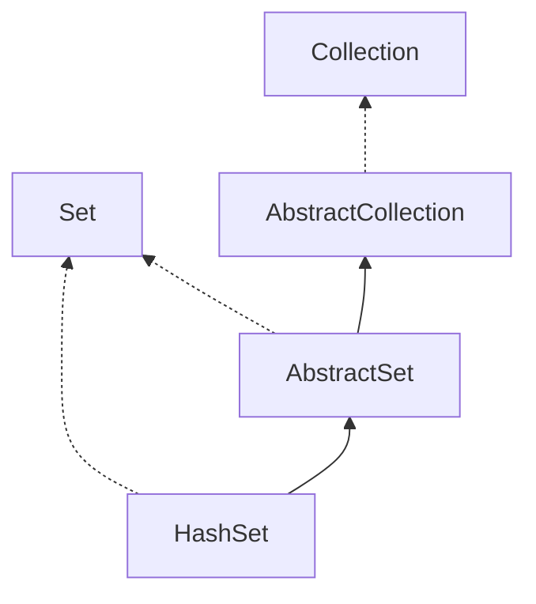

# Collections-Hashset


<!--more-->

> [HashSet详解](http://cmsblogs.com/?p=599)


## 介绍
1. 基于`HashMap`保存元素不保证有序,不包含`重复`元素,允许`null`值.主要继承关系如图:
  


## 参数
```java
static final long serialVersionUID = -5024744406713321676L;

//底层存储用的hashMap
private transient HashMap<E,Object> map;

//定义一个Object对象作为HashMap的value
private static final Object PRESENT = new Object();

```
## 常用方法
由于底层是`hashmap`存储的,所以基本是一样的.没什么区别.实现不重复插入是通过比较put操作的返回值是不是null
```java

public Iterator<E> iterator() {
    return map.keySet().iterator();
}

public int size() {
    return map.size();
}

public boolean isEmpty() {
    return map.isEmpty();
}

public boolean contains(Object o) {
    return map.containsKey(o);
}

public boolean add(E e) {
    return map.put(e, PRESENT)==null;
}

public boolean remove(Object o) {
    return map.remove(o)==PRESENT;
}

public void clear() {
    map.clear();
}

@SuppressWarnings("unchecked")
public Object clone() {
    try {
        HashSet<E> newSet = (HashSet<E>) super.clone();
        newSet.map = (HashMap<E, Object>) map.clone();
        return newSet;
    } catch (CloneNotSupportedException e) {
        throw new InternalError(e);
    }
}
```
