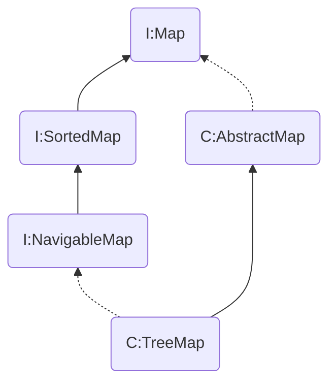

# Collections-Treemap


<!--more-->

> [红黑树介绍](https://www.tianxiaobo.com/2018/01/11/%E7%BA%A2%E9%BB%91%E6%A0%91%E8%AF%A6%E7%BB%86%E5%88%86%E6%9E%90/)
> [TreeMap解析](http://cmsblogs.com/?p=1013)
## 简介
1. TreeMap底层基于`红黑树`实现,可以保证在`log(n)`时间复杂度下完成增删改查的操作,效率很高,由于基于`红黑树`,所以保持`有序`.
2. TreeMap继承自`AbstractMap`,并实现了`NavigableMap`(主要是提供一些导航类的操作,比如获得比当前节点小的最大值,比当前节点大的最小值等)
3. `key`不允许为空



## 基本操作
```java
    /* get 操作 可以返回null值 如果key为null 则会抛 NPE */
    public V get(Object key) {
        Entry<K,V> p = getEntry(key);
        return (p==null ? null : p.value);
    }

    /* get操作实际调用的方法 key为null时 抛NPE */
    final Entry<K,V> getEntry(Object key) {
        // Offload comparator-based version for sake of performance
        // 除非用comparator构建TreeMap,否则不使用它,为了性能考虑
        if (comparator != null)
            return getEntryUsingComparator(key);
        if (key == null)
            throw new NullPointerException();
        @SuppressWarnings("unchecked")
            Comparable<? super K> k = (Comparable<? super K>) key;
        Entry<K,V> p = root;
        while (p != null) {
            int cmp = k.compareTo(p.key);//compare key遍历二叉树
            if (cmp < 0)
                p = p.left;
            else if (cmp > 0)
                p = p.right;
            else
                return p;
        }
        return null;
    }


public V put(K key, V value) {
           //用t表示二叉树的当前节点
            Entry<K,V> t = root;
            //t为null表示一个空树，即TreeMap中没有任何元素，直接插入
            if (t == null) {
                //比较key值，个人觉得这句代码没有任何意义，空树还需要比较、排序？
                compare(key, key); // type (and possibly null) check
                //将新的key-value键值对创建为一个Entry节点，并将该节点赋予给root
                root = new Entry<>(key, value, null);
                //容器的size = 1，表示TreeMap集合中存在一个元素
                size = 1;
                //修改次数 + 1
                modCount++;
                return null;
            }
            int cmp;     //cmp表示key排序的返回结果
            Entry<K,V> parent;   //父节点
            // split comparator and comparable paths
            Comparator<? super K> cpr = comparator;    //指定的排序算法
            //如果cpr不为空，则采用既定的排序算法进行创建TreeMap集合
            if (cpr != null) {
                do {
                    parent = t;      //parent指向上次循环后的t
                    //比较新增节点的key和当前节点key的大小
                    cmp = cpr.compare(key, t.key);
                    //cmp返回值小于0，表示新增节点的key小于当前节点的key，则以当前节点的左子节点作为新的当前节点
                    if (cmp < 0)
                        t = t.left;
                    //cmp返回值大于0，表示新增节点的key大于当前节点的key，则以当前节点的右子节点作为新的当前节点
                    else if (cmp > 0)
                        t = t.right;
                    //cmp返回值等于0，表示两个key值相等，则新值覆盖旧值，并返回新值
                    else
                        return t.setValue(value);
                } while (t != null);
            }
            //如果cpr为空，则采用默认的排序算法进行创建TreeMap集合
            else {
                if (key == null)     //key值为空抛出异常
                    throw new NullPointerException();
                /* 下面处理过程和上面一样 */
                Comparable<? super K> k = (Comparable<? super K>) key;
                do {
                    parent = t;
                    cmp = k.compareTo(t.key);
                    if (cmp < 0)
                        t = t.left;
                    else if (cmp > 0)
                        t = t.right;
                    else
                        return t.setValue(value);
                } while (t != null);
            }
            //将新增节点当做parent的子节点
            Entry<K,V> e = new Entry<>(key, value, parent);
            //如果新增节点的key小于parent的key，则当做左子节点
            if (cmp < 0)
                parent.left = e;
          //如果新增节点的key大于parent的key，则当做右子节点
            else
                parent.right = e;
            /*
             *  上面已经完成了排序二叉树的的构建，将新增节点插入该树中的合适位置
             *  下面fixAfterInsertion()方法就是对这棵树进行调整、平衡，具体过程参考上面的五种情况
             */
            fixAfterInsertion(e);
            //TreeMap元素数量 + 1
            size++;
            //TreeMap容器修改次数 + 1
            modCount++;
            return null;
        }


    /**
     * 上面代码中do{}代码块是实现排序二叉树的核心算法，通过该算法我们可以确认新增节点在该树的正确位置。
     * 找到正确位置后将插入即可，这样做了其实还没有完成，因为我知道TreeMap的底层实现是红黑树，红黑树是一棵平衡排序二叉树，
     * 普通的排序二叉树可能会出现失衡的情况，所以下一步就是要进行调整。fixAfterInsertion(e); 调整的过程务必会涉及到红黑树的左
     * 旋、右旋、着色三个基本操作
     * 新增节点后的修复操作
     * x 表示新增节点
     */
     private void fixAfterInsertion(Entry<K,V> x) {
            x.color = RED;    //新增节点的颜色为红色
 
            //循环 直到 x不是根节点，且x的父节点不为红色
            while (x != null && x != root && x.parent.color == RED) {
                //如果X的父节点（P）是其父节点的父节点（G）的左节点
                if (parentOf(x) == leftOf(parentOf(parentOf(x)))) {
                    //获取X的叔节点(U)
                    Entry<K,V> y = rightOf(parentOf(parentOf(x)));
                    //如果X的叔节点（U） 为红色（情况三）
                    if (colorOf(y) == RED) {     
                        //将X的父节点（P）设置为黑色
                        setColor(parentOf(x), BLACK);
                        //将X的叔节点（U）设置为黑色
                        setColor(y, BLACK);
                        //将X的父节点的父节点（G）设置红色
                        setColor(parentOf(parentOf(x)), RED);
                        x = parentOf(parentOf(x));
                    }
                    //如果X的叔节点（U为黑色）；这里会存在两种情况（情况四、情况五）
                    else {   
                        //如果X节点为其父节点（P）的右子树，则进行左旋转（情况四）
                        if (x == rightOf(parentOf(x))) {
                            //将X的父节点作为X
                            x = parentOf(x);
                            //右旋转
                            rotateLeft(x);
                        }
                        //（情况五）
                        //将X的父节点（P）设置为黑色
                        setColor(parentOf(x), BLACK);
                        //将X的父节点的父节点（G）设置红色
                        setColor(parentOf(parentOf(x)), RED);
                        //以X的父节点的父节点（G）为中心右旋转
                        rotateRight(parentOf(parentOf(x)));
                    }
                }
                //如果X的父节点（P）是其父节点的父节点（G）的右节点
                else {
                    //获取X的叔节点（U）
                    Entry<K,V> y = leftOf(parentOf(parentOf(x)));
                  //如果X的叔节点（U） 为红色（情况三）
                    if (colorOf(y) == RED) {
                        //将X的父节点（P）设置为黑色
                        setColor(parentOf(x), BLACK);
                        //将X的叔节点（U）设置为黑色
                        setColor(y, BLACK);
                        //将X的父节点的父节点（G）设置红色
                        setColor(parentOf(parentOf(x)), RED);
                        x = parentOf(parentOf(x));
                    }
                  //如果X的叔节点（U为黑色）；这里会存在两种情况（情况四、情况五）
                    else {
                        //如果X节点为其父节点（P）的右子树，则进行左旋转（情况四）
                        if (x == leftOf(parentOf(x))) {
                            //将X的父节点作为X
                            x = parentOf(x);
                           //右旋转
                            rotateRight(x);
                        }
                        //（情况五）
                        //将X的父节点（P）设置为黑色
                        setColor(parentOf(x), BLACK);
                        //将X的父节点的父节点（G）设置红色
                        setColor(parentOf(parentOf(x)), RED);
                        //以X的父节点的父节点（G）为中心右旋转
                        rotateLeft(parentOf(parentOf(x)));
                    }
                }
            }
            //将根节点G强制设置为黑色
            root.color = BLACK;
        }


```
