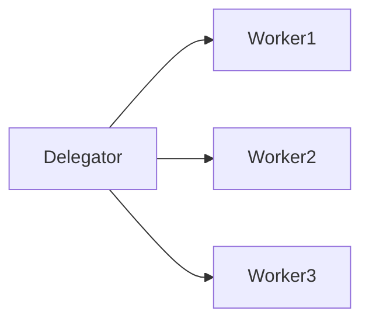

> 幂等性:一个幂等操作的特点是其任意多次执行所产生的影响均与一次执行的影响相同

#### 多线程的代价
1. 多线程的逻辑一般比较复杂,需要注意多线程访问共享数据时的逻辑.
2. **上下文切换开销大**:CPU从一个线程切换到另一个线程时,需要先存储当前线程的本地数据,程序指针等,然后载入另一个线程的本地数据,程序指针等,最后才开始执行.这个过程就叫做`上下文切换`
3. 增加资源消耗.线程需要一些内存来维护他本地的堆栈,它也需要占用操作系统中的一些资源来管理线程.

#### 并发编程模型
1. 并行工作者

一个分配者分配给不同的工作者进行调度,这属于最常见的并发模型,`JUC`中许多并发实用的工具都基于这个模型
* 优点:容易理解
* 缺点:
    * 共享状态可能会很复杂  
    ```mermaid
    graph LR
    Delegator --> worker1
    Delegator --> worker2
    Delegator --> worker3
    worker1 --> shared-state-in-memory
    worker2 --> shared-state-in-memory
    worker3 --> shared-state-in-memory
    worker1 --> shared-state-in-db
    worker2 --> shared-state-in-db
    worker3 --> shared-state-in-db
    ```
    在多线程情况下,需要确保通过某种方式存取共享数据时,对数据的修改可以对其他线程可见.线程需要避免竞态,死锁等并发问题.   
    在等待访问共享数据结构时,线程之间的互相等待会造成一定程度的串行化,因为许多并发数据结构时阻塞的,同一时间只能有一个或少量线程被允许访问.  
    `非阻塞并发算法`可以一定程度上减少并发的竞争,提升性能,但不好实现.另一种方法是`使用可持久化的数据结构`.意思是,在修改的时候.可持久化的数据结构可以保证他的前一个版本不受影响,如果多个线程只想同一个可持久化的数据结构,并且其中一个线程进行了修改,进行修改的线程会获得一个指向新结构的引用,其他线程保持对就结构的引用.从而保证一致性.该类数据结构有`String`,`CopyOnWriteArrayList`
    * 无状态工作者  
    共享状态能够被系统中其他线程修改,所以`worker`每次都需要重读状态,以保证能访问到最新的副本.`worker` 无法再内部保存这个状态,所以为无状态
    * 任务顺序不确定
    不能保证各个`worker`按顺序执行 

