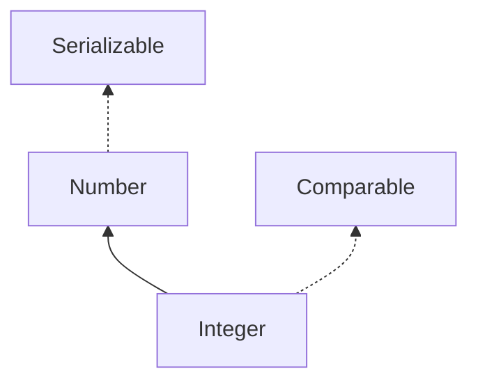

# Integer

`Integer`是`int`的包装类,Integer中只是包含了一个`int`属性,然后封装了一些操作
> [Hollis的Integer](http://www.hollischuang.com/archives/1058)
## 继承关系
Integer继承了Number操作,Number主要是返回当前对象的int,long,double值等



## java的拆装箱是如何实现的?
java的自动拆装箱是从`JDK5`开始出现的特性.通过反编译可以发现,在编译成`class`字节码文件时,装箱的时候自动调用了`Integer.valueOf(int)`,拆箱的时候自动调用了`Integer.intValue(Integer)`
> [深入剖析java中的装箱和拆箱](https://www.cnblogs.com/dolphin0520/p/3780005.html)

## Integer的缓存机制
Integer的缓存机制是一个面试常考点,看过源码后会比较清晰.所有valueOf的方法最后都会调用`Integer.valueOf(int i)`.
```java
public static Integer valueOf(int i) {
    if (i >= IntegerCache.low && i <= IntegerCache.high)//首先会判断是有缓存的值
        return IntegerCache.cache[i + (-IntegerCache.low)];//如果有的话,会去cache中相应的位置拿而不用重新new一个
    return new Integer(i);
}
```
IntegerCache中初始化加载可以了解一下
```java
//默认是存储[-128,127]的值
private static class IntegerCache {
    static final int low = -128;
    static final int high;
    static final Integer cache[];

    static {
        // high value may be configured by property
        int h = 127;
        //高位的值可以配置
        String integerCacheHighPropValue =
            sun.misc.VM.getSavedProperty("java.lang.Integer.IntegerCache.high");
        if (integerCacheHighPropValue != null) {
            try {
                int i = parseInt(integerCacheHighPropValue);
                i = Math.max(i, 127);
                // Maximum array size is Integer.MAX_VALUE
                h = Math.min(i, Integer.MAX_VALUE - (-low) -1);
            } catch( NumberFormatException nfe) {
                // If the property cannot be parsed into an int, ignore it.
            }
        }
        high = h;

        cache = new Integer[(high - low) + 1];//新建一个缓存的数组
        int j = low;
        for(int k = 0; k < cache.length; k++)
            cache[k] = new Integer(j++);

        // range [-128, 127] must be interned (JLS7 5.1.7)
        //必须要保证有[-128,127]
        assert IntegerCache.high >= 127;
    }

    private IntegerCache() {}
}
```


## 源码
### 属性
```java
//Native注解表示能被本地方法调用,我也不太清楚是个啥
//最小值 -2^31
@Native public static final int   MIN_VALUE = 0x80000000;

    //最大值 2^31-1
@Native public static final int   MAX_VALUE = 0x7fffffff;

//获得int的原始类型
public static final Class<Integer>  TYPE = (Class<Integer>) Class.getPrimitiveClass("int");

//存int值的地方
private final int value;
```

### static方法
```java
//i toString的值
//radix 转换成radix进制
public static String toString(int i, int radix) {
    //radix在[2,36]之内用十进制
    if (radix < Character.MIN_RADIX || radix > Character.MAX_RADIX)
        radix = 10;

    /* Use the faster version */
    //调用十进制专用的toString 快一些
    if (radix == 10) {
        return toString(i);
    }

    //int类型时32位 加个符号 就是33位
    char buf[] = new char[33];
    boolean negative = (i < 0);//是否小于0
    int charPos = 32;

    //把正数转为负数应该是为了防止负数最小值转成正数时溢出
    if (!negative) {
        i = -i;
    }
    
    while (i <= -radix) {
        buf[charPos--] = digits[-(i % radix)];
        i = i / radix;
    }
    buf[charPos] = digits[-i];

    if (negative) {
        buf[--charPos] = '-';
    }
    //创建一个合适长度的String
    return new String(buf, charPos, (33 - charPos));
}


static void getChars(int i, int index, char[] buf) {
    int q, r;
    int charPos = index;
    char sign = 0;

    if (i < 0) {
        sign = '-';
        i = -i;
    }

     // 每次循环过后，都会将i中的走后两位保存到字符数组buf中的最后两位中，读者可以将数字i设置为12345678测试一下， 
     //第一次循环结束之后，buf[7] = 8,buf[6]=7。第二次循环结束之后，buf[5] = 6,buf[4] = 5。
    while (i >= 65536) {
        q = i / 100;
    // really: r = i - (q * 100);
        r = i - ((q << 6) + (q << 5) + (q << 2));
        i = q;
        //取DigitOnes[r]的目的其实取数字r%10的结果
        buf [--charPos] = DigitOnes[r];
        //取DigitTens[r]的目的其实是取数字r/10的结果
        buf [--charPos] = DigitTens[r];
    }

    // Fall thru to fast mode for smaller numbers
    // assert(i <= 65536, i);
    //循环将其他数字存入字符数组中空余位置
    for (;;) {
          //这里其实就是除以10。取数52429和16+3的原因在后文分析。
        q = (i * 52429) >>> (16+3);
        // r = i-(q*10) ...
        r = i - ((q << 3) + (q << 1));   
        //将数字i的最后一位存入字符数组，
        //还是12345678那个例子，这个for循环第一次结束后，buf[3]=4。
        buf [--charPos] = digits [r];
        i = q;
        //for循环结束后，buf内容为“12345678”；
        if (i == 0) break;
    }
    if (sign != 0) {
        buf [--charPos] = sign;
    }
}

//其中用到的几个数组

//100以内的数字除以10的结果（取整），
//比如取DigitTens[78]，返回的是数字7
//只要是70-79的数字，返回的都是7，依次类推，所以总结出规律，其实就是返回的对应数字除10取整的结果。
final static char [] DigitTens = {
    '0', '0', '0', '0', '0', '0', '0', '0', '0', '0',
    '1', '1', '1', '1', '1', '1', '1', '1', '1', '1',
    '2', '2', '2', '2', '2', '2', '2', '2', '2', '2',
    '3', '3', '3', '3', '3', '3', '3', '3', '3', '3',
    '4', '4', '4', '4', '4', '4', '4', '4', '4', '4',
    '5', '5', '5', '5', '5', '5', '5', '5', '5', '5',
    '6', '6', '6', '6', '6', '6', '6', '6', '6', '6',
    '7', '7', '7', '7', '7', '7', '7', '7', '7', '7',
    '8', '8', '8', '8', '8', '8', '8', '8', '8', '8',
    '9', '9', '9', '9', '9', '9', '9', '9', '9', '9',
    } ;

 //100以内的数字对10取模的结果，
//比如取DigitTens[78]，返回的8
final static char [] DigitOnes = {
    '0', '1', '2', '3', '4', '5', '6', '7', '8', '9',
    '0', '1', '2', '3', '4', '5', '6', '7', '8', '9',
    '0', '1', '2', '3', '4', '5', '6', '7', '8', '9',
    '0', '1', '2', '3', '4', '5', '6', '7', '8', '9',
    '0', '1', '2', '3', '4', '5', '6', '7', '8', '9',
    '0', '1', '2', '3', '4', '5', '6', '7', '8', '9',
    '0', '1', '2', '3', '4', '5', '6', '7', '8', '9',
    '0', '1', '2', '3', '4', '5', '6', '7', '8', '9',
    '0', '1', '2', '3', '4', '5', '6', '7', '8', '9',
    '0', '1', '2', '3', '4', '5', '6', '7', '8', '9',
    } ;
final static char[] digits = {
    '0' , '1' , '2' , '3' , '4' , '5' ,
    '6' , '7' , '8' , '9' , 'a' , 'b' ,
    'c' , 'd' , 'e' , 'f' , 'g' , 'h' ,
    'i' , 'j' , 'k' , 'l' , 'm' , 'n' ,
    'o' , 'p' , 'q' , 'r' , 's' , 't' ,
    'u' , 'v' , 'w' , 'x' , 'y' , 'z'
};


//将i变成十进制的字符串
public static String toString(int i) {
    if (i == Integer.MIN_VALUE)//避免溢出 先判断你是不是最小值
        return "-2147483648";
    int size = (i < 0) ? stringSize(-i) + 1 : stringSize(i);//获取i的长度,若是负数则再添一个符号位
    char[] buf = new char[size];
    getChars(i, size, buf);//将i对应的字符提取出来
    return new String(buf, true);//生成新的字符串
}

//按指定的进制解析字符串为整型
//radix 进制
public static int parseInt(String s, int radix)
            throws NumberFormatException
{
    /*
     * 该方法会在IntegerCache初始化之前被触发,所以要注意不要使用valueOf方法
     * WARNING: This method may be invoked early during VM initialization
     * before IntegerCache is initialized. Care must be taken to not use
     * the valueOf method.
     */

    if (s == null) {
        throw new NumberFormatException("null");
    }

    if (radix < Character.MIN_RADIX) {
        throw new NumberFormatException("radix " + radix +
                                        " less than Character.MIN_RADIX");
    }

    if (radix > Character.MAX_RADIX) {
        throw new NumberFormatException("radix " + radix +
                                        " greater than Character.MAX_RADIX");
    }

    int result = 0;
    boolean negative = false;
    int i = 0, len = s.length();
    int limit = -Integer.MAX_VALUE;
    int multmin;
    int digit;

    if (len > 0) {
        char firstChar = s.charAt(0);//拿到数组下标为0的元素
        if (firstChar < '0') { // Possible leading "+" or "-" 可能是+ 或 -
            if (firstChar == '-') {//负数时的操作
                negative = true;
                limit = Integer.MIN_VALUE;
            } else if (firstChar != '+')//不是 - 也不是 + 就报错
                throw NumberFormatException.forInputString(s);

            if (len == 1) // Cannot have lone "+" or "-"不能只含有 + 或 - 号
                throw NumberFormatException.forInputString(s);
            i++;
        }
        multmin = limit / radix;
        while (i < len) {
            // Accumulating negatively avoids surprises near MAX_VALUE
            // 负数是为了避免最大值附近的意外
            digit = Character.digit(s.charAt(i++),radix);
            if (digit < 0) {
                throw NumberFormatException.forInputString(s);
            }
            if (result < multmin) {
                throw NumberFormatException.forInputString(s);
            }
            result *= radix;
            if (result < limit + digit) {
                throw NumberFormatException.forInputString(s);
            }
            result -= digit;
        }
    } else {
        throw NumberFormatException.forInputString(s);
    }
    return negative ? result : -result;
}
```
### hashCode & equals
```java
public static int hashCode(int value) {
    return value;
}

public boolean equals(Object obj) {
    if (obj instanceof Integer) {
        return value == ((Integer)obj).intValue();
    }
    return false;
}
```

