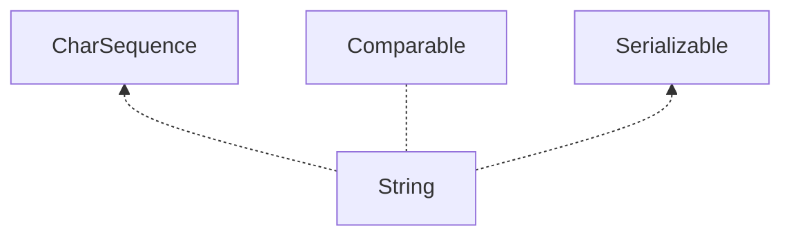

# String

> [为什么被设计成final?](https://www.zhihu.com/question/31345592)

String是不可变的(Immutable),String类用`final`修饰,拒绝继承.
## 为什么要设置为不可变的?
1. 线程安全.创建一个String实际上是创建了一个`栈中的引用`和`堆中的数组`两部分,如果不设置成不可变的话,`堆中的数组`改变后,会对所有指向该地址的引用造成影响.
2. 可以进行数据共享:字符串常量池
3. 因为字符串是不可变的，所以在它创建的时候hashcode就被缓存了，不需要重新计算。这就使得字符串很适合作为Map中的键，字符串的处理速度要快过其它的键对象。这就是HashMap中的键往往都使用字符串
## 怎样实现不可变?
String类被修饰为`final`保证无法被继承,存储字符的数组`value`被设置成私有且是final保证无法被外界访问.并且String中没有暴露任何接口来使value的值改变,只是在程序内部做出修改.
```java
public final class String
    implements java.io.Serializable, Comparable<String>, CharSequence {
    /** The value is used for character storage. */
    private final char value[];
    }
}
```
## 真的不可变吗?
NO~通过反射可以强制修改.
```java
public static void testReflection() throws Exception {
    
    //创建字符串"Hello World"， 并赋给引用s
    String s = "Hello World"; 
    
    System.out.println("s = " + s);	//Hello World
    
    //获取String类中的value字段
    Field valueFieldOfString = String.class.getDeclaredField("value");
    
    //改变value属性的访问权限
    valueFieldOfString.setAccessible(true);
    
    //获取s对象上的value属性的值
    char[] value = (char[]) valueFieldOfString.get(s);
    
    //改变value所引用的数组中的第5个字符
    value[5] = '_';
    
    System.out.println("s = " + s);  //Hello_World
}

```
## JDK6 和 JDK7 subString的区别
`JDK6`中subString返回的新字符串实际上是和原字符串公用一个字符数组只是offset,count,value值不同.缺陷在于如果字符数组很大,但是subString只需要很小一部分就会导致这个特别大的对象一直得不到回收,一直在被引用,很耗资源,可能导致内存泄露
`JDK7`为了规避这个问题,就重新生成了一个新的字符数组
[Hollis](http://www.hollischuang.com/archives/1232)

## replaceFirst、replaceAll、replace区别
1. replaceFirst和replaceAll都是利用正则表达式去替换
2. replace是根据比较字符串来进行替换,会替换所有符合调价你的字符

## String重载 "+" 原理分析
编译器自动引入了 `StringBuilder`
[参考blog](https://blog.csdn.net/codejas/article/details/78662146)

## String.valueOf()和Integer.toString()区别
toString会做空校验,若为null会抛`NPE`
valueOf则会处理null情况,输出`"null"`
[参考blog](https://blog.csdn.net/a281246240/article/details/48969217)
## 继承关系

## 属性
```java
//存储字符的数组
/** The value is used for character storage. */
private final char value[];

//hash值
/** Cache the hash code for the string */
private int hash; // Default to 0
```

## 构造方法
```java
//新建一个空字符串,这个构造方法没啥必要
public String() {
    this.value = "".value;
}

//根据原来的字符串新建一个一模一样的
//除非明确需要再建一个一样的字符串,否则由于字符串的不可变性,没什么必要
public String(String original) {
    this.value = original.value;
    this.hash = original.hash;
}

//分配一个新的可以代表该value数组的字符串
public String(char value[]) {
    this.value = Arrays.copyOf(value, value.length);
}

//从指定的offset开始,新建一个指定长度count的String
//参数校验有问题时会数组下标越界异常
public String(char value[], int offset, int count) {
    if (offset < 0) {
        throw new StringIndexOutOfBoundsException(offset);
    }
    if (count <= 0) {
        if (count < 0) {
            throw new StringIndexOutOfBoundsException(count);
        }
        if (offset <= value.length) {
            this.value = "".value;
            return;
        }
    }
    // Note: offset or count might be near -1>>>1.
    if (offset > value.length - count) {
        throw new StringIndexOutOfBoundsException(offset + count);
    }
    this.value = Arrays.copyOfRange(value, offset, offset+count);
}

//新建一个指定offset开始,count长度,指定编码格式的字符串
//会抛NPE,数组下标越界等异常
public String(byte bytes[], int offset, int length, String charsetName)
        throws UnsupportedEncodingException {
    if (charsetName == null)
        throw new NullPointerException("charsetName");
    checkBounds(bytes, offset, length);
    this.value = StringCoding.decode(charsetName, bytes, offset, length);
}

```

## 常用方法
```java
    //获得该index下的字符
    //index范围错误会抛数组下标越界异常
    public char charAt(int index) {
        if ((index < 0) || (index >= value.length)) {
            throw new StringIndexOutOfBoundsException(index);
        }
        return value[index];
    }


    //复制当前字符串指定区间到目标字符数组中
    //srcBegin:当前字符串开始的offset
    //srcEnd:当前字符串结束位置
    //dstBegin:目标数组开始追加的位置
    //要注意的时,arrayCopy会有几种情况引发下标越界:目标数组的长度是不能改变的
    public void getChars(int srcBegin, int srcEnd, char dst[], int dstBegin) {
        if (srcBegin < 0) {
            throw new StringIndexOutOfBoundsException(srcBegin);
        }
        if (srcEnd > value.length) {
            throw new StringIndexOutOfBoundsException(srcEnd);
        }
        if (srcBegin > srcEnd) {
            throw new StringIndexOutOfBoundsException(srcEnd - srcBegin);
        }
        System.arraycopy(value, srcBegin, dst, dstBegin, srcEnd - srcBegin);
    }
    //根据平台默认编码格式将字符串解析成字节数组
    public byte[] getBytes() {
        return StringCoding.encode(value, 0, value.length);
    }

    //经典的equals方法
    public boolean equals(Object anObject) {
        if (this == anObject) {
            return true;
        }
        if (anObject instanceof String) {
            String anotherString = (String)anObject;
            int n = value.length;
            if (n == anotherString.value.length) {
                char v1[] = value;
                char v2[] = anotherString.value;
                int i = 0;
                while (n-- != 0) {
                    if (v1[i] != v2[i])
                        return false;
                    i++;
                }
                return true;
            }
        }
        return false;
    }

    //计算hashCode
    //由于String的不可变性,计算一次hash即可
    public int hashCode() {
        int h = hash;
        if (h == 0 && value.length > 0) {
            char val[] = value;

            for (int i = 0; i < value.length; i++) {
                h = 31 * h + val[i];
            }
            hash = h;
        }
        return h;
    }


    //比较字符内容是否相同
    public boolean contentEquals(CharSequence cs) {
        // Argument is a StringBuffer, StringBuilder
        //如果是StringBuilder或者Stringbuffer 用下面的比较
        if (cs instanceof AbstractStringBuilder) {
            if (cs instanceof StringBuffer) {
                synchronized(cs) {
                   return nonSyncContentEquals((AbstractStringBuilder)cs);
                }
            } else {
                return nonSyncContentEquals((AbstractStringBuilder)cs);
            }
        }
        // Argument is a String
        if (cs instanceof String) {
            return equals(cs);
        }
        // Argument is a generic CharSequence
        char v1[] = value;
        int n = v1.length;
        if (n != cs.length()) {
            return false;
        }
        for (int i = 0; i < n; i++) {
            if (v1[i] != cs.charAt(i)) {
                return false;
            }
        }
        return true;
    }

    //StringBuffer/StringBuilder的比较
    private boolean nonSyncContentEquals(AbstractStringBuilder sb) {
        char v1[] = value;
        char v2[] = sb.getValue();
        int n = v1.length;
        if (n != sb.length()) {
            return false;
        }
        for (int i = 0; i < n; i++) {
            if (v1[i] != v2[i]) {
                return false;
            }
        }
        return true;
    }


    //比较操作
    //相等返回0
    //当前字符串<anotherString 返回 <0的值
    //当前字符串>anotherString 返回 >0的值
    public int compareTo(String anotherString) {
        int len1 = value.length;
        int len2 = anotherString.value.length;
        int lim = Math.min(len1, len2);
        char v1[] = value;
        char v2[] = anotherString.value;

        int k = 0;
        while (k < lim) {
            char c1 = v1[k];
            char c2 = v2[k];
            if (c1 != c2) {
                return c1 - c2;
            }
            k++;
        }
        return len1 - len2;
    }

    //是否以prefix开头
    //toffset表示从这个位置开始查
    public boolean startsWith(String prefix, int toffset) {
        char ta[] = value;
        int to = toffset;
        char pa[] = prefix.value;
        int po = 0;
        int pc = prefix.value.length;
        // Note: toffset might be near -1>>>1.
        if ((toffset < 0) || (toffset > value.length - pc)) {
            return false;
        }
        while (--pc >= 0) {
            if (ta[to++] != pa[po++]) {
                return false;
            }
        }
        return true;
    }

    //是否以suffix结尾
    public boolean endsWith(String suffix) {
        return startsWith(suffix, value.length - suffix.value.length);
    }

    //查找字符串出现的位置
    //source是被查询的字符串
    //target是需要查询的字符串
    static int indexOf(char[] source, int sourceOffset, int sourceCount,
            char[] target, int targetOffset, int targetCount,
            int fromIndex) {
        if (fromIndex >= sourceCount) {
            return (targetCount == 0 ? sourceCount : -1);
        }
        if (fromIndex < 0) {
            fromIndex = 0;
        }
        if (targetCount == 0) {
            return fromIndex;
        }

        char first = target[targetOffset];
        int max = sourceOffset + (sourceCount - targetCount);

        for (int i = sourceOffset + fromIndex; i <= max; i++) {
            /* Look for first character. */
            if (source[i] != first) {
                while (++i <= max && source[i] != first);
            }

            /* Found first character, now look at the rest of v2 */
            if (i <= max) {
                int j = i + 1;
                int end = j + targetCount - 1;
                for (int k = targetOffset + 1; j < end && source[j]
                        == target[k]; j++, k++);

                if (j == end) {
                    /* Found whole string. */
                    return i - sourceOffset;
                }
            }
        }
        return -1;
    }

    //从特定的index开始新建一个新的子串
    //包括beginIndex
    public String substring(int beginIndex) {
        if (beginIndex < 0) {
            throw new StringIndexOutOfBoundsException(beginIndex);
        }
        int subLen = value.length - beginIndex;
        if (subLen < 0) {
            throw new StringIndexOutOfBoundsException(subLen);
        }
        return (beginIndex == 0) ? this : new String(value, beginIndex, subLen);
    }

    //新建一个子串:范围是[beginIndex,endIndex)
    public String substring(int beginIndex, int endIndex) {
        if (beginIndex < 0) {
            throw new StringIndexOutOfBoundsException(beginIndex);
        }
        if (endIndex > value.length) {
            throw new StringIndexOutOfBoundsException(endIndex);
        }
        int subLen = endIndex - beginIndex;
        if (subLen < 0) {
            throw new StringIndexOutOfBoundsException(subLen);
        }
        return ((beginIndex == 0) && (endIndex == value.length)) ? this
                : new String(value, beginIndex, subLen);
    }

    //替换所有出现的oldChar为newChar
    //返回一个新的字符串或者不变
    public String replace(char oldChar, char newChar) {
        if (oldChar != newChar) {
            int len = value.length;
            int i = -1;
            char[] val = value; /* avoid getfield opcode */

            while (++i < len) {
                if (val[i] == oldChar) {
                    break;
                }
            }
            if (i < len) {
                char buf[] = new char[len];
                for (int j = 0; j < i; j++) {
                    buf[j] = val[j];
                }
                while (i < len) {
                    char c = val[i];
                    buf[i] = (c == oldChar) ? newChar : c;
                    i++;
                }
                return new String(buf, true);
            }
        }
        return this;
    }
```

## JDK1.8 新方法
```java
    //在字符串之间添加分割符
    //eg:String message = String.join("-", "Java", "is", "cool");
    // message returned is: "Java-is-cool"
    //参数如果为null 会抛NPE
    public static String join(CharSequence delimiter, CharSequence... elements) {
        Objects.requireNonNull(delimiter);
        Objects.requireNonNull(elements);
        // Number of elements not likely worth Arrays.stream overhead.
        StringJoiner joiner = new StringJoiner(delimiter);
        for (CharSequence cs: elements) {
            joiner.add(cs);
        }
        return joiner.toString();
    }
    //join重载方法
    //参数如果为null 会抛NPE
    public static String join(CharSequence delimiter,
            Iterable<? extends CharSequence> elements) {
        Objects.requireNonNull(delimiter);
        Objects.requireNonNull(elements);
        StringJoiner joiner = new StringJoiner(delimiter);
        for (CharSequence cs: elements) {
            joiner.add(cs);
        }
        return joiner.toString();
    }
```
