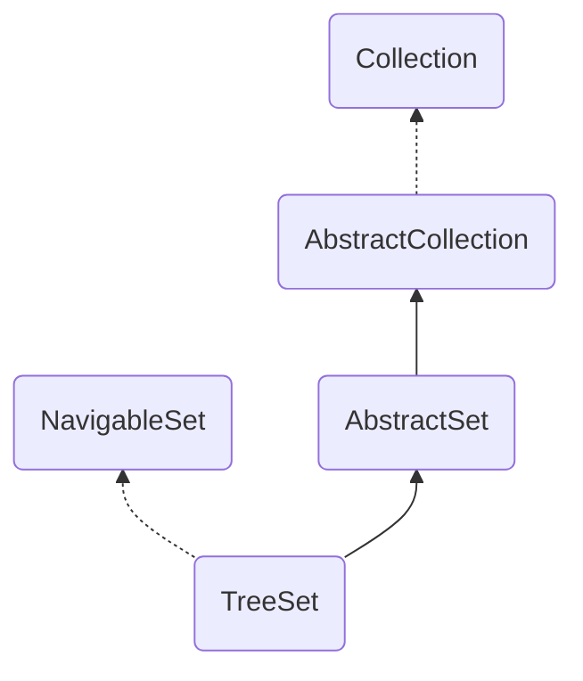

<!--more-->

如同`HashSet`基于`HashMap`一样,`TreeSet`基于`TreeMap`,`TreeMap`是一棵有序的红黑树,那么`TreeSet`也如此.提供有序的set集合,不允许重复插入
继承关系如下:


## 参数
```java
private transient NavigableMap<E,Object> m;
        
//PRESENT会被当做Map的value与key构建成键值对
 private static final Object PRESENT = new Object();
```

## 构造方法
```java
    //创建TreeSet的基础构成 map
    TreeSet(NavigableMap<E,Object> m) {
        this.m = m;
    }

    //按照自然排序构建
    public TreeSet() {
        this(new TreeMap<E,Object>());
    }

    //按照自定义排序构建
    public TreeSet(Comparator<? super E> comparator) {
        this(new TreeMap<>(comparator));
    }

    //按照自然排序构建 并添加入参集合的元素
    public TreeSet(Collection<? extends E> c) {
        this();
        addAll(c);
    }

    //根据已有的TreeSet构建一个新的TreeSet
    public TreeSet(SortedSet<E> s) {
        this(s.comparator());
        addAll(s);
    }

```

## 主要方法
```java
/**
 * 将集合中所有的元素添加到TreeMap中
 * 如果集合为空,或者任一元素为null并且使用的是自然排序,或者
 * comparator不允许为空元素则会抛NPE
 */
public  boolean addAll(Collection<? extends E> c) {
    // Use linear-time version if applicable
    if (m.size()==0 && c.size() > 0 &&
        c instanceof SortedSet &&
        m instanceof TreeMap) {
        SortedSet<? extends E> set = (SortedSet<? extends E>) c;
        TreeMap<E,Object> map = (TreeMap<E, Object>) m;
        Comparator<?> cc = set.comparator();
        Comparator<? super E> mc = map.comparator();
        if (cc==mc || (cc != null && cc.equals(mc))) {
            map.addAllForTreeSet(set, PRESENT);
            return true;
        }
    }
    return super.addAll(c);
}

/* add操作 会去重 put返回值为null时说明成功 */
public boolean add(E e) {
    return m.put(e, PRESENT)==null;
}

/* 获取并移除第一个元素 如果set为空 则返回null */
public E pollFirst() {
        Map.Entry<E,?> e = m.pollFirstEntry();
        return (e == null) ? null : e.getKey();
}

/* 获取并移除最后一个元素 如果set为空 则返回null */
public E pollLast() {
        Map.Entry<E,?> e = m.pollFirstEntry();
        return (e == null) ? null : e.getKey();
}

/**
 * 返回此 set 的部分视图，其元素大于（或等于，如果 inclusive 为 true）fromElement。
 */
public NavigableSet<E> tailSet(E fromElement, boolean inclusive) {
    return new TreeSet<>(m.tailMap(fromElement, inclusive));
}

/**
 * 返回此 set 的部分视图，其元素大于等于 fromElement。
 */
public SortedSet<E> tailSet(E fromElement) {
    return tailSet(fromElement, true);
}

/**
 * 返回此 set 的部分视图，其元素范围从 fromElement 到 toElement。
 */
public NavigableSet<E> subSet(E fromElement, boolean fromInclusive,
        E toElement,   boolean toInclusive) {
        return new TreeSet<>(m.subMap(fromElement, fromInclusive,
            toElement,   toInclusive));
}

/**
 * 返回此 set 的部分视图，其元素从 fromElement（包括）到 toElement（不包括）。
 */
public SortedSet<E> subSet(E fromElement, E toElement) {
    return subSet(fromElement, true, toElement, false);
}
```
